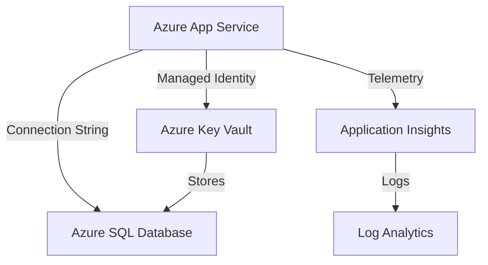

# Kev's Inventory Management Application

A modern ASP.NET Core 8.0 MVC inventory management application with Azure Key Vault integration for secure credential management.

[](https://dotnet.microsoft.com/download/dotnet/8.0)
[](https://azure.microsoft.com/)
[](LICENSE)

## ?? Features

- **Full CRUD Operations**: Create, Read, Update, and Delete inventory items
- **Secure Credentials**: Azure Key Vault integration for connection string management
- **Managed Identity**: Passwordless authentication to Azure resources
- **Responsive UI**: Bootstrap 5 with Font Awesome icons
- **Database**: Entity Framework Core with Azure SQL Database
- **Monitoring**: Application Insights integration
- **Infrastructure as Code**: Complete Bicep templates for Azure deployment

## ?? Prerequisites

### For Local Development
- [.NET 8.0 SDK](https://dotnet.microsoft.com/download/dotnet/8.0)
- [Visual Studio 2022](https://visualstudio.microsoft.com/) or [VS Code](https://code.visualstudio.com/)
- [SQL Server](https://www.microsoft.com/sql-server) (optional - uses in-memory database for development)

### For Azure Deployment
- [Azure CLI](https://docs.microsoft.com/cli/azure/install-azure-cli)
- [Azure Developer CLI (azd)](https://learn.microsoft.com/azure/developer/azure-developer-cli/install-azd)
- Azure subscription with appropriate permissions

## ??? Architecture



### Azure Resources
- **App Service (B1)**: Hosts the .NET 8.0 MVC application
- **Azure SQL Database (Basic)**: Stores inventory data
- **Azure Key Vault**: Securely stores connection strings and secrets
- **User-Assigned Managed Identity**: Provides passwordless authentication
- **Application Insights**: Monitors application performance
- **Log Analytics Workspace**: Centralized logging

## ?? Quick Start

### Local Development

1. **Clone the repository**
   ```bash
   git clone <your-repo-url>
   cd kevs-inventory-app
   ```

2. **Restore packages**
   ```bash
   dotnet restore
   ```

3. **Run the application**
   ```bash
   dotnet run --project InventoryApp.csproj
   ```

4. **Access the app**
   - Navigate to: `https://localhost:5001` or `http://localhost:5000`
   - The app uses an in-memory database with sample data in development mode

### Deploy to Azure

1. **Login to Azure**
   ```bash
   azd auth login
   ```

2. **Initialize the environment**
   ```bash
   azd init
   ```

3. **Deploy the application**
   ```bash
   azd up
   ```

4. **Access your deployed app**
   - The deployment will output the URL
   - Example: `https://azapp<unique-id>.azurewebsites.net`

## ?? Project Structure

```
kevs-inventory-app/
??? Controllers/
?   ??? InventoryController.cs    # CRUD operations
??? Models/
?   ??? InventoryItem.cs          # Data model
??? Views/
?   ??? Inventory/                # UI views
??? Data/
?   ??? InventoryContext.cs       # EF Core context
??? Scripts/
?   ??? DatabaseSetup.sql         # Database initialization
??? infra/                        # Azure infrastructure
?   ??? main.bicep               # Main infrastructure
?   ??? core/                    # Modular Bicep files
??? azure.yaml                   # Azure Developer CLI config
??? Program.cs                   # Application entry point
??? README.md                    # This file
```

## ?? Security Features

- ? **Azure Key Vault Integration**: All secrets stored securely
- ? **Managed Identity**: No credentials in code or configuration
- ? **HTTPS Enforced**: TLS 1.2 minimum
- ? **Connection String Security**: Stored in Key Vault, never in source code
- ? **RBAC**: Role-based access control for Azure resources

## ??? Database Schema

### InventoryItems Table
| Column | Type | Constraints |
|--------|------|-------------|
| Id | int | Primary Key, Identity |
| Name | nvarchar(100) | Required |
| Description | nvarchar(500) | Optional |
| Quantity | int | Required, >= 0 |
| SerialNumber | nvarchar(50) | Required, Unique |

## ??? Configuration

### Azure Key Vault Setup

1. Create an Azure Key Vault
2. Store your connection string as a secret named `DefaultConnection`
3. Grant your Managed Identity the `Key Vault Secrets User` role

### App Settings

The application requires these settings in Azure App Service:

```json
{
  "KeyVaultName": "your-keyvault-name",
  "AZURE_CLIENT_ID": "your-managed-identity-client-id",
  "ASPNETCORE_ENVIRONMENT": "Production"
}
```

### Connection String

Stored in Azure Key Vault with the name `DefaultConnection`:
```
Server=tcp:your-server.database.windows.net,1433;Initial Catalog=InventoryDB;...
```

## ?? Monitoring

### Application Insights
Monitor your application in real-time:
- Live Metrics
- Request/Response times
- Failure rates
- Custom telemetry

### Log Analytics
Query application logs:
```kusto
traces
| where timestamp > ago(1h)
| where severityLevel > 2
| project timestamp, message, severityLevel
| order by timestamp desc
```

## ?? Testing

### Run Tests
```bash
dotnet test
```

### Manual Testing
1. Browse to the application URL
2. Test CRUD operations:
   - Add a new inventory item
   - Edit an existing item
   - Delete an item
   - Verify serial number uniqueness validation

## ?? Documentation

- [Deployment Guide](DEPLOYMENT.md) - Detailed deployment instructions
- [API Documentation](docs/API.md) - Controller endpoints
- [Troubleshooting](.azure/troubleshooting.md) - Common issues and solutions

## ?? Deployment Options

### Option 1: Azure Developer CLI (Recommended)
```bash
azd up
```

### Option 2: GitHub Actions
See `.github/workflows/azure-deploy.yml` for CI/CD setup

### Option 3: Manual Deployment
See [DEPLOYMENT.md](DEPLOYMENT.md) for step-by-step instructions

## ?? Development

### Prerequisites
- .NET 8.0 SDK
- Visual Studio 2022 or VS Code with C# extension

### Build
```bash
dotnet build
```

### Run
```bash
dotnet run --project InventoryApp.csproj
```

### Publish
```bash
dotnet publish -c Release -o ./publish
```

## ?? Contributing

Contributions are welcome! Please feel free to submit a Pull Request.

1. Fork the repository
2. Create your feature branch (`git checkout -b feature/AmazingFeature`)
3. Commit your changes (`git commit -m 'Add some AmazingFeature'`)
4. Push to the branch (`git push origin feature/AmazingFeature`)
5. Open a Pull Request

## ?? License

This project is licensed under the MIT License - see the [LICENSE](LICENSE) file for details.

## ?? Support

For issues, questions, or contributions:
- Open an [Issue](../../issues)
- Check [Troubleshooting Guide](.azure/troubleshooting.md)
- Review [Deployment Documentation](DEPLOYMENT.md)

## ?? Additional Resources

- [ASP.NET Core Documentation](https://docs.microsoft.com/aspnet/core)
- [Azure Key Vault Documentation](https://docs.microsoft.com/azure/key-vault)
- [Azure App Service Documentation](https://docs.microsoft.com/azure/app-service)
- [Entity Framework Core Documentation](https://docs.microsoft.com/ef/core)

## ?? Roadmap

- [ ] Add user authentication (Azure AD B2C)
- [ ] Implement role-based access control
- [ ] Add export functionality (CSV, Excel)
- [ ] Implement barcode scanning
- [ ] Add inventory alerts and notifications
- [ ] Create mobile-responsive dashboard

---

**Made with ?? using ASP.NET Core and Azure**
